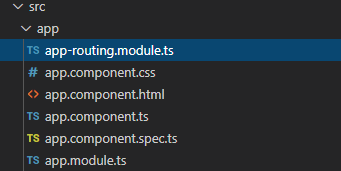
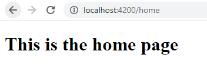

Learn how to add a Page Not Found component you can redirect users to for invalid routes, and then automatically redirect them to your home page after several seconds.

Angular Version: 9

----
****

Let's create a new Angular project using the Angular CLI.   On your command line create a new project like this

**ng new page-not-found**

Angular will ask you if you want to add routing to your project.  Type y.  Then select the default stylesheet. 

**? Would you like to add Angular routing? (y/N)**

Now, we already have an Angular application created with support for routing!  



Next, let's create a couple of components that we can route to.  The Angular CLI can do that for us.   Go to your page-not-found project directory and add a component called 'home' and a component called 'other' like so

**ng generate component home**

**ng generate component other**

Great!  Now we have two components to route to.  Let's add a header in home.component.html, replacing the default HTML, so it's easier to see where we are.  Do the same for the 'other' component in other.component.html as well.

```html
<h1>This is the home page</h1>
```

Now let's add the routes for these components!

In app-routing.module.ts, add these routes to the the Routes array created by the Angular CLI. The empty path will redirect to the home path.   Don't forget to import these components into the routing module as well!

```typescript
const routes: Routes = [
  {path: '', redirectTo: 'home', pathMatch: 'full'},
  {path: 'home', component: HomeComponent},
  {path: 'other', component: OtherComponent}
];
```

Next, we add the router outlet to app.component.html.   Delete the default html the Angular CLI created and replace it with the router outlet.  The router-outlet tag acts as a placeholder that Angular dynamically fills with your content based on the current router state.

```html
<router-outlet></router-outlet>
```

Great!  Go head and run the app using **ng serve** and you should see the home page like this



Now let's use routerLink to add a navigation link to 'other' on home.component.html.  Then do the same from 'other' to 'home' in the other.component.html.

```html
<h1>This is the home page</h1>

<a routerLink='/other'>Go To Other Page</a>
```
At this point, you should be able to toggle between the 'home' and 'other' pages.  Notice the URL changes to reflect the active route.  You can also switch routes by entering the url directly: http://localhost:4200/other or http://localhost:4200/home

So, what do we do if a user enters a page that we do not have, such as http://localhost:4200/bad?   The user ends up on a blank page and that's not very friendly!   Let's handle this page-not-found situation.  

First, we add a new component we can route to when the path is invalid.   On your command line enter 

**ng generate component page-not-found**

In page-not-found.component.html, replace the default HTML with this, which explains to the user that the page they are seeking was not found and that they will be redirected to the home page.

```html
<h1>Page Not Found</h1>
<p>Sorry, this page was not found</p>
<p>You will be redirected to the home page in a few seconds</p>
```

To handle the redirect, make the page-not-found.component.ts file look like this.  We use the ngAfterViewInit lifecycle hook to redirect to the home page after a 3 second delay, using the navigateByUrl method on Angular's Router class.  Note that the router class cannot be accessed form within the setTimeOut() function by using 'this.router' as you  might expect.  To access the Router class from within setTimeOut(), we add **self = this** inside ngAfterViewInit() and use 'self.router'.

```typescript
import { Component, OnInit, AfterViewInit } from '@angular/core';
import { Router } from '@angular/router';

@Component({
  selector: 'app-page-not-found',
  templateUrl: './page-not-found.component.html',
  styleUrls: ['./page-not-found.component.css']
})
export class PageNotFoundComponent {

  constructor(private router: Router) { }

  ngAfterViewInit() {
    let self = this;

    setTimeout(function () {
      self.router.navigateByUrl('/home');
    }, 3000)
  }
}
```

The final step is to add a wildard(**) to the Routes array in the app-routing.module.ts pointing to our page-not-found component. The router will select this route if the requested URL does not match any paths for the defined routes. 

```typescript
const routes: Routes = [
  {path: '', redirectTo: 'home', pathMatch: 'full'},
  {path: 'home', component: HomeComponent},
  {path: 'other', component: OtherComponent},
  {path: '**', component: PageNotFoundComponent}
];
```

And that's it!  Now if you type in a bad URL such as http://localhost:4200/bad, you will be redirected to the 'page-not-found' component which will explain to the user what happened and then redirect them to the home page after 3 seconds. 

Here is a [stackblitz](https://stackblitz.com/edit/angular-ivy-medwvu) with the all the code so you can see it in action!

Keep on developing!
